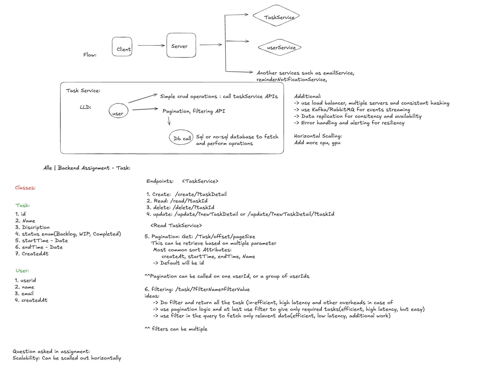

# Task Management Microservice (Go)

### Features:
- In-memory task storage
- CRUD operations
- Pagination & filtering by status, userId
- Simple logging & error handling

---

<!-- Architecture diagram --> (more of a rough work which i did before to starting the project)



# Architecture Overview (based on shared design)

The structure is pretty straightforward and clean. There are four layers:
1.	Routes — this is where all the endpoints are defined. It’s just wiring.
2.	Controllers — these handle request parsing, validation, and sending proper responses. They don’t hold any business logic.
3.	Services — this is where everything meaningful happens. Task creation, filtering, pagination, updating, deletion — it all lives here.
4.	Models — simple Go structs that define what a Task looks like, and include enums for status and priority.

Tasks are stored in an in-memory map. This gives us fast access and avoids any DB dependency. To avoid issues with concurrent requests (since Go routines run in parallel), a mutex is used around write operations. Each task gets a unique ID.

This setup was intentionally kept simple: no external database, no auth, no containerization. Just something you can run with go run and test right away. The code is split up cleanly so it’s easy to follow or extend.


# Scalability & Growth (based on current setup)

Right now it’s a single-service, in-memory app — great for testing or small demos. But it’s also structured in a way that makes it easy to grow:
•	If we need persistence, we can drop in a DB like Postgres or Mongo. Just update the service layer and swap the map logic with DB calls.
•	If we want to support multiple users, auth and user handling can be added without reworking everything. The structure supports that cleanly.
•	The code is thread-safe, but obviously memory-based — so it won’t persist data across restarts. That’s fine for now, but we’d need a DB in real scenarios.
•	All the common features (pagination, filtering, sorting) are already there, so it can handle a decent workload even as-is.
•	If needed, we can containerize this easily — nothing in the code prevents that.

So overall, it’s lightweight by design, but not a dead end. It can be grown into something more complete without a rewrite.


## How to Run

```bash
git clone <your_repo_url>
cd taskmanager
go mod init taskmanager
go mod tidy
go run main.go

